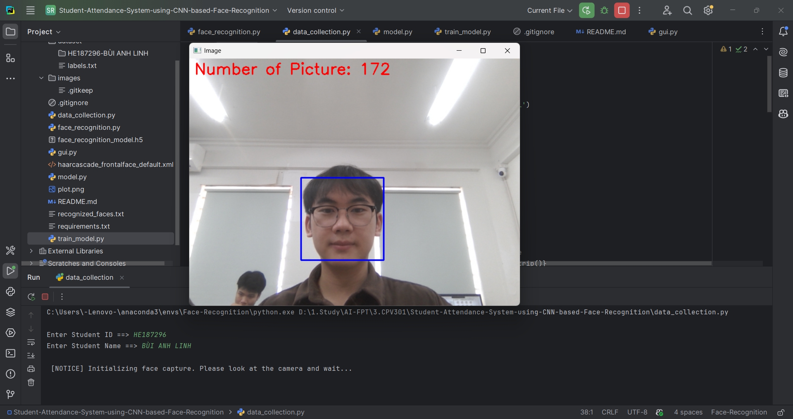
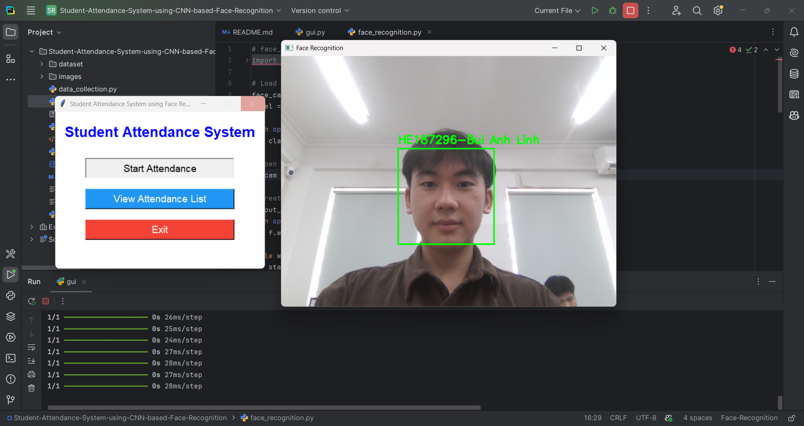
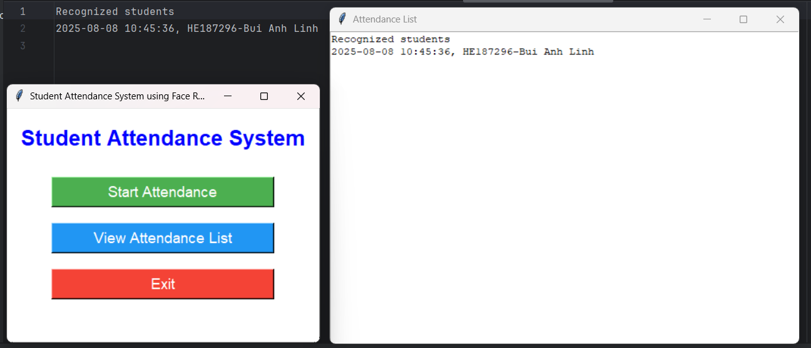

# Student Attendance System using CNN-based Face Recognition

This project is a face recognition-based student attendance system using Convolutional Neural Networks (CNN) and OpenCV. It allows you to collect face data, train a model, recognize faces in real time, and manage attendance records through a graphical user interface (GUI).

## Features
- Collect face images for each student (Student ID and Name)
- Prevent duplicate Student IDs during data collection
- Train a CNN model for face recognition
- Real-time face recognition and attendance logging
- GUI for starting attendance, viewing attendance list, and exiting the application

## Demo
### Data Collection


### Face Recognition & Attendance


## Results


## Project Structure
- `data_collection.py`: Collects face images and saves them by student ID and name
- `train_model.py`: Trains the CNN model using collected images
- `face_recognition.py`: Recognizes faces and logs attendance
- `model.py`: Defines the CNN architecture
- `gui.py`: Provides a graphical user interface for the system
- `dataset/`: Contains face images and labels
- `images/`: Contains demo and result images for documentation
- `recognized_faces.txt`: Stores attendance logs
- `requirements.txt`: Lists required Python packages

## Setup
1. Clone the repository
2. Install dependencies:
   ```bash
   pip install -r requirements.txt
   ```
3. Run `data_collection.py` to collect face data
4. Run `train_model.py` to train the model
5. Run `gui.py` to use the graphical interface for attendance

## Requirements
See `requirements.txt` for required Python packages.

## Usage
- Make sure your webcam is connected
- Follow the prompts in each script or use the GUI

## License
MIT License
